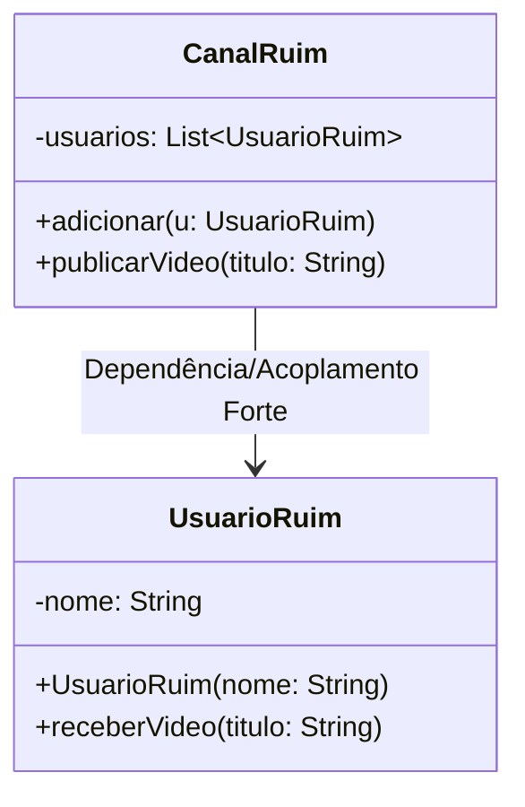

# Anti-Pattern (Observer):
O anti-padrão do Observer ocorre quando sua aplicação causa acoplamento excessivo, vazamentos de memória ou complexidade desnecessária. Isso acontece, por exemplo, quando o sujeito mantém observadores que nunca são removidos, gerando consumo desnecessário de recursos; quando as notificações são muito frequentes, afetando a performance; ou quando os observadores passam a depender da ordem de atualização, criando comportamentos imprevisíveis. Nesse caso, o padrão perde seu propósito de simplicidade e baixo acoplamento, tornando o sistema difícil de manter e depurar.

## Diagrama UML:


## Exemplo pratico em java:

```java
import java.util.ArrayList;
import java.util.List;

// Implementação incorreta
class CanalRuim {
    private List<UsuarioRuim> usuarios = new ArrayList<>();

    public void adicionar(UsuarioRuim u) {
        usuarios.add(u);
    }

    // Notificação feita de forma ineficiente e acoplada
    public void publicarVideo(String titulo) {
        System.out.println("Publicando vídeo: " + titulo);
        for (UsuarioRuim u : usuarios) {
            // Fazendo chamada direta e pesada
            u.receberVideo(titulo);
        }
    }
}

// Observador mal implementado
class UsuarioRuim {
    private String nome;

    public UsuarioRuim(String nome) {
        this.nome = nome;
    }

    public void receberVideo(String titulo) {
        // Lógica pesada e dependente da ordem
        System.out.println(nome + " está processando o vídeo " + titulo + " (isso pode travar o sistema!)");
        try {
            Thread.sleep(2000); // Simula demora
        } catch (InterruptedException e) {
            e.printStackTrace();
        }
    }
}

// Demonstração do mau uso
public class ExemploAntiPattern {
    public static void main(String[] args) {
        CanalRuim canal = new CanalRuim();
        canal.adicionar(new UsuarioRuim("Diego"));
        canal.adicionar(new UsuarioRuim("Marcos"));

        canal.publicarVideo("Tutorial de Java");
    }
}

```
- O canal depende diretamente da classe UsuarioRuim, sem interface — há acoplamento forte.
- Cada observador faz tarefas demoradas dentro da notificação, o que trava o sistema.
- Nenhum método para remover observadores — risco de vazamento de memória.
- Ordem de execução importa, o que quebra a independência dos observadores.
