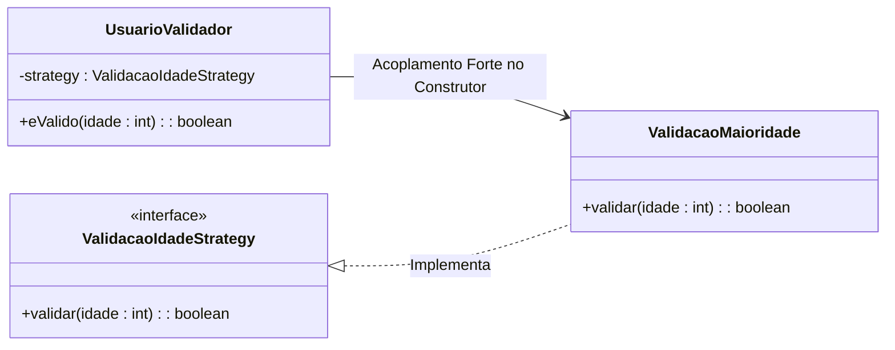

<h2>Strategy - Anti-Pattern</h2>

<p>O principal AntiPattern é o uso excessivo do padrão para lógicas simples e estáticas, onde um if-else seria mais legível e direto, adicionando complexidade desnecessária. Outras armadilhas incluem a criação de um "inferno de estratégias" com um número exagerado de classes minúsculas e difíceis de gerenciar, ou o desenvolvimento de estratégias que dependem excessivamente do estado interno do contexto, quebrando o encapsulamento e criando um forte acoplamento.</p>

<h4>Exemplo em codigo:</h4>



<h4>Exemplo em codigo:</h4>

```java
// Anti-Pattern: Sobre-Engenharia (Over-Engineering)
// O Strategy é usado onde um simples condicional resolve.

public class UsuarioValidadorSimples {
    public boolean eMaiorIdade(int idade) {
        if (idade >= 18) {
            return true;
        }
        return false;
    }
}

public class AplicacaoAntiPattern {
    public static void main(String[] args) {
        UsuarioValidadorSimples validador = new UsuarioValidadorSimples();
        System.out.println("Usuário com 20 anos é válido? " + validador.eMaiorIdade(20));
        // Se a lógica mudar (ex: maioridade aos 21), apenas um if é modificado.
        // Se fosse Strategy, 3 arquivos seriam criados/modificados desnecessariamente.
    }
}
```