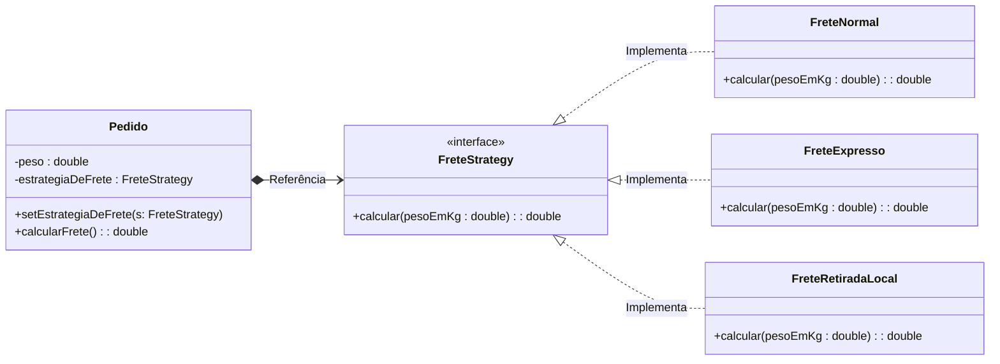

<h2>Strategy - Pattern</h2>

<p>O padrão Strategy é um padrão de projeto comportamental que transforma famílias de algoritmos em objetos intercambiáveis. Ele é usado para evitar o uso de condicionais extensas (if/else ou switch-case) ao permitir que o comportamento seja selecionado em tempo de execução, delegando a responsabilidade de execução para um objeto Strategy que implementa uma interface comum. Isso adere ao Princípio Aberto/Fechado (OCP), pois novos comportamentos podem ser adicionados sem modificar o código do objeto Contexto.</p>

<h4>Exemplo UML:</h4>




<h4>Exemplo em codigo:</h4>

```java
public interface FreteStrategy {
    /**
     * Calcula o custo do frete para um determinado peso.
     * @param pesoEmKg O peso do pedido.
     * @return O valor do frete em reais.
     */
    double calcular(double pesoEmKg);
}

```

```java
public class FreteNormal implements FreteStrategy {
    @Override
    public double calcular(double pesoEmKg) {
        return pesoEmKg * 1.25;
    }
}

public class FreteExpresso implements FreteStrategy {
    @Override
    public double calcular(double pesoEmKg) {
        return pesoEmKg * 2.50;
    }
}

public class FreteRetiradaLocal implements FreteStrategy {
    @Override
    public double calcular(double pesoEmKg) {
        return 0.0;
    }
}
```

```java

public class Pedido {
    private double peso;
    private FreteStrategy estrategiaDeFrete; 

    public Pedido(double peso) {
        this.peso = peso;
    }

    /**
     * Permite que o cliente (ou a lógica de negócio) defina a estratégia em tempo de execução.
     * @param estrategiaDeFrete A estratégia de cálculo de frete a ser usada.
     */
    public void setEstrategiaDeFrete(FreteStrategy estrategiaDeFrete) {
        this.estrategiaDeFrete = estrategiaDeFrete;
    }

    /**
     * Delega o cálculo do frete para o objeto Strategy.
     * @return O custo do frete calculado.
     */
    public double calcularFrete() {
        if (estrategiaDeFrete == null) {
            throw new IllegalStateException("A estratégia de frete não foi definida!");
        }
        return estrategiaDeFrete.calcular(this.peso);
    }
}

```

```java
public class LojaVirtual {
    public static void main(String[] args) {
        Pedido pedido = new Pedido(5.0);

        // Cenário 1: O cliente escolhe Frete Normal
        pedido.setEstrategiaDeFrete(new FreteNormal());
        System.out.printf("Custo do Frete Normal: R$ %.2f%n", pedido.calcularFrete()); // Saída: R$ 6,25

        // Cenário 2: O cliente escolhe Frete Expresso
        pedido.setEstrategiaDeFrete(new FreteExpresso());
        System.out.printf("Custo do Frete Expresso: R$ %.2f%n", pedido.calcularFrete()); // Saída: R$ 12,50

        // Cenário 3: O cliente decide retirar na loja
        pedido.setEstrategiaDeFrete(new FreteRetiradaLocal());
        System.out.printf("Custo para Retirada Local: R$ %.2f%n", pedido.calcularFrete()); // Saída: R$ 0,00
    }
}
```
